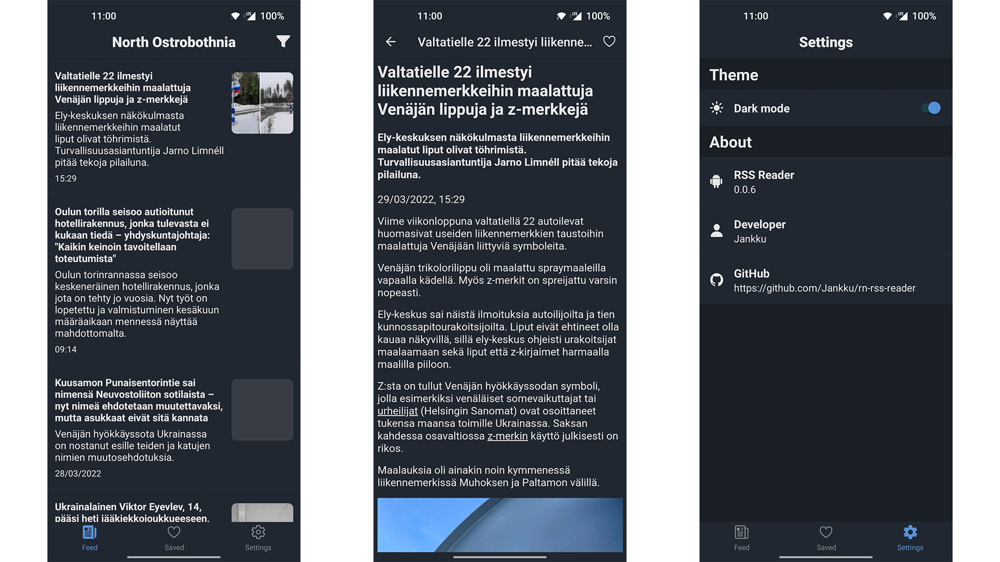

# Yle RSS Reader

Built with React Native and Expo.



## Features

- Load news from Yle's regional RSS feeds
- Use location to get your region
- Save news articles
- Light/dark theme


## Building

To build development build do the following:

- Clone the project:
```
git clone https://github.com/Jankku/rn-rss-reader.git
```
- Navigate to project folder.
- Rename `.env.example` file to `.env`.
- Create a LocationIQ account [here](https://locationiq.com/).
- Find LocationIQ API key [here](https://my.locationiq.com/dashboard#accesstoken) and copy paste it to `LOCATION_API_KEY` variable in `.env` file.
- Create `local.properties` file to the root of android folder with the following content:
```
# Path to Android SDK. On Windows:
sdk.dir=C\:\\Users\\Username\\AppData\\Local\\Android\\Sdk
```
- Run `npm install` in terminal to install dependencies.
- Connect your Android phone to your computer.
- Run `adb devices` in terminal to confirm ADB connection.
- Run `npm run android` in terminal to build the app.
- Development client should be installed to your device and the app launched.
